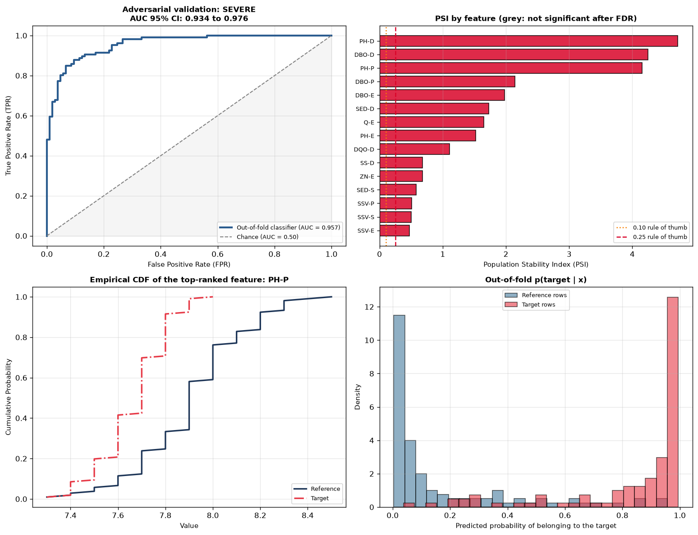

# driftdetect

Checks whether two tabular datasets come from the same distribution, which columns differ, and by how much. It is meant for train/test splits and for comparing a model's training data with what it sees in production.

It is tested two ways: on a synthetic table where the drift was injected into known columns, and on two periods of real data from a wastewater treatment plant.



*Real plant data, January–May 1991 against May–October 1991. Top left: a classifier separates the two periods almost perfectly. Top right: PSI per feature, grey where the shift is not statistically significant. Bottom: the most shifted feature, primary-settler pH, and the classifier's out-of-fold probabilities.*

---

## What it does

**Per-column tests.** For each column, the tool runs a two-sample Kolmogorov–Smirnov test and computes the Population Stability Index (PSI) and the Wasserstein-1 distance divided by the reference IQR. A column only gets a severity (LOW, MODERATE or SEVERE) if its shift is statistically significant. That means the smaller of the KS and PSI p-values, doubled for the two tests, has to pass a Benjamini–Hochberg false-discovery-rate step across all columns at q = 0.05.

The PSI p-value comes from its approximate null distribution, PSI ≈ (1/n + 1/m)·χ²(B−1). This is why significance comes first. At 150 rows per side and 10 bins, the 95th percentile of PSI with no drift at all is about 0.23, so the usual "PSI above 0.10 means drift" rule flags columns that have not moved. A test covers exactly this case.

**Adversarial validation.** A LightGBM classifier is trained to tell the two datasets apart, and its out-of-fold ROC AUC is reported with a bootstrap 95% interval. AUC near 0.5 means the classifier cannot tell the sets apart. Near 1.0 it can. Before training, any column that separates the sets on its own (univariate AUC ≥ 0.98) is set aside as probable leakage, for example a row ID or a timestamp.

**Attribution.** Columns are ranked by two scores: how much the classifier's AUC drops when the column is permuted, measured on held-out rows, and the column's own univariate AUC. Removing the top-ranked columns one at a time and re-running the classifier shows whether a few columns explain the drift or it is spread across many.

**Importance weights.** The classifier's probabilities give density-ratio weights for the reference rows, so that training or validation can be reweighted towards the target distribution. The weights are flattened with a power of 0.5, clipped at the 99th percentile, and reported with their effective sample size.

---

## Results

### Injected drift, where the answer is known

The reference has 3,000 rows and the target 1,500. Drift was injected into three columns: `user_age`, `monthly_income` and `debt_to_income_ratio`. Six columns come from the same distribution on both sides, and `transaction_id` is a row counter that separates the two sets trivially.

| | Found |
|---|---|
| Shifted columns flagged | the three injected columns, all SEVERE |
| Unshifted columns flagged | none of the six |
| Set aside as leakage | `transaction_id` |
| Adversarial AUC | 0.830 (95% CI 0.817–0.842) |
| AUC after removing the three columns | 0.500 |

### Real data: two periods of a wastewater treatment plant

The data comes from the [UCI Water Treatment Plant dataset](https://archive.ics.uci.edu/dataset/106/water+treatment+plant), with 29 measured columns (the derived removal-efficiency columns are left out). The two periods are January–May 1991 (105 records) and May–October 1991 (106 records). These are the same windows [wateraudit](https://github.com/muqsithanif/wateraudit) uses to calibrate and then test its prediction intervals. Those intervals under-covered on the test period, and this audit shows why.

- 19 of the 29 columns shift significantly. The largest shifts are pH in the primary and secondary settlers, BOD at every stage, secondary-settler sediments, and inlet flow.
- The adversarial AUC is 0.957 (95% CI 0.934–0.976), so the two periods are almost perfectly separable.
- Removing the three top-ranked columns only lowers the AUC to 0.941. Unlike the injected case, the shift is spread across the plant rather than concentrated in a few columns.
- The importance weights keep an effective sample size of 37% of the reference rows. Reweighting would lean on about a third of the calibration data.

The numbers are in `results/injected_summary.json` and `results/uci-water_summary.json`.

---

## Limits

- The per-column tests ignore interactions between columns; the adversarial classifier covers those, but only as a single score.
- KS is conservative on discrete columns, and the PSI null is an approximation that needs enough rows per bin.
- Permutation importance splits credit between correlated columns, so a column can rank low while its correlated partner ranks high.
- With about 100 rows per period, the plant results carry wide uncertainty on everything except the headline that the periods differ.

## Run it

```bash
pip install -r requirements.txt
python scripts/run_audit.py --dataset injected
python scripts/run_audit.py --dataset uci-water
pytest -q
```

## Tests

There are ten tests. These are the ones worth naming:

- **Noise is not graded as drift.** Twenty unshifted columns at 150 rows per side all come out NONE, even though several exceed the fixed 0.10 PSI rule.
- **Missing values are ignored, not fatal.** A shifted column with gaps is still detected.
- **A null comparison gives an adversarial AUC near 0.5, and a row ID is caught as leakage.**
- **Attribution ranks the one shifted column first.**
- **Scale does not change the normalized Wasserstein distance.**

## License

The code is MIT-licensed; see [LICENSE](LICENSE). The UCI Water Treatment Plant dataset in `data/uci_water_treatment/` was created by Manel Poch and is licensed under [CC BY 4.0](https://creativecommons.org/licenses/by/4.0/), [doi:10.24432/C5FS4C](https://doi.org/10.24432/C5FS4C).
