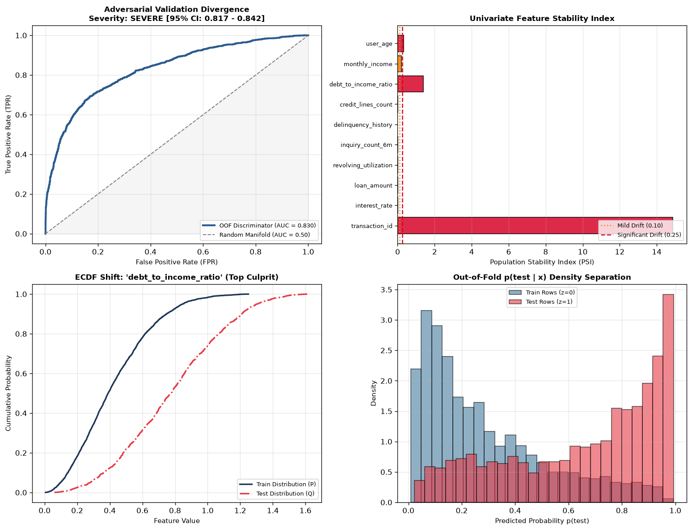
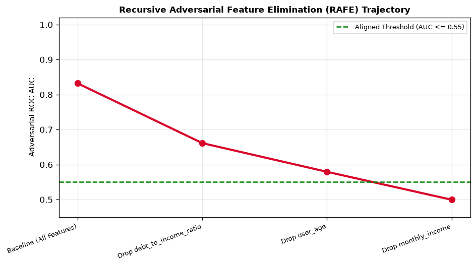

# driftdetect

Production covariate shift quantification, adversarial validation, and adaptive train-test alignment engine for competitive machine learning and tabular production pipelines.



*Comprehensive drift diagnostics: Out-of-fold adversarial validation ROC curve, population stability index (PSI) per feature, empirical CDF divergence for primary culprit features, and out-of-fold probability density separation.*

---

## The Distribution Shift Problem: Silent Model Failure

In competitive data science (e.g. Kaggle private leaderboard shakeups) and production tabular systems, machine learning models silently degrade when the test distribution diverges from the training distribution:

$$P_{\text{train}}(X) \neq P_{\text{test}}(X)$$

Standard validation strategies fail under shift:
1. **Uninformative p-values:** With large sample sizes ($N > 10^4$), standard statistical tests flag every feature as drifted even when the physical effect size is negligible.
2. **Hidden Multivariate Shift:** Features can appear identical in univariate histograms while shifting drastically in their joint correlation structure.
3. **Data Leakage Contamination:** Monotonic transaction IDs, sequence indices, or timestamps cause false alarms in discriminator models.

---

## Architectural & Mathematical Framework

```
Train Reference X_P ──┐
                      ├─► [ Leakage Guard ] ──► Exclude Trivial Separators (AUC > 0.98)
Test Target X_Q ──────┘            │
                                   ▼
┌──────────────────────────────────┴───────────────────────────────────┐
│                                                                      │
│  1. Univariate Statistical Testing                                   │
│     ├── Two-sample Kolmogorov-Smirnov (Effect Size & Critical Value) │
│     ├── Normalized Wasserstein-1 Distance (W1 / IQR_P)               │
│     ├── Sample-Size Calibrated PSI (Chi-Square Null Distribution)    │
│     └── Benjamini-Hochberg False Discovery Rate (FDR q = 0.05)       │
│                                                                      │
│  2. Multivariate Adversarial Validation                              │
│     ├── 5-Fold Stratified Out-of-Fold Discriminator (LightGBM/RF)    │
│     └── 95% Bootstrap Confidence Interval on ROC-AUC                 │
│                                                                      │
│  3. Feature Drift Attribution & Elimination                          │
│     ├── Permutation Drift Importance (AUC drop on permutation)       │
│     ├── Consensus Culprit Score C_k (Rank Aggregation)               │
│     └── Recursive Adversarial Feature Elimination (RAFE)             │
│                                                                      │
│  4. Adaptive Train-Test Alignment                                    │
│     ├── Importance-Weighted CV (IWCV) via Shimodaira Flattening      │
│     └── Adversarial Stratified K-Fold Splitters                      │
└──────────────────────────────────────────────────────────────────────┘
```

---

## Mathematical Formulations

### 1. Sample-Size Aware Population Stability Index (PSI)
Standard industrial rules use fixed thresholds ($\text{PSI} < 0.10$). On small sample sizes ($N < 500$), random sampling noise triggers false alarms. Under the null hypothesis $H_0: P = Q$, the empirical PSI follows a scaled Chi-square distribution:

$$\text{PSI} \sim \left(\frac{1}{n} + \frac{1}{m}\right) \chi^2_{B-1}$$

`core/stats.py` computes sample-size calibrated thresholds:

$$\text{PSI}_{\text{crit}}(\alpha) = \max\left(0.10, \; \left(\frac{1}{n} + \frac{1}{m}\right) \chi^2_{B-1, \, 1-\alpha}\right)$$

### 2. Normalized Wasserstein-1 Distance
Univariate Earth Mover's Distance measures total integral mass discrepancy between empirical CDFs:

$$W_1(P, Q) = \int_{-\infty}^\infty |F_P(x) - F_Q(x)| \, dx$$

To enable comparisons across features with wildly different units (e.g. `age` vs `monthly_income`), $W_1$ is normalized by the interquartile range of the reference distribution:

$$\tilde{W}_1 = \frac{W_1(P, Q)}{\text{IQR}(X_P) + \epsilon}$$

### 3. Recursive Adversarial Feature Elimination (RAFE)
When adversarial validation reveals severe separation ($\text{AUC} > 0.80$), RAFE iteratively eliminates the top culprit feature and measures the decay of discriminability:



```
Iteration 0 (Baseline All Features) : Adversarial AUC = 0.8322 [Severe Shift]
Iteration 1 (Drop debt_to_income)   : Adversarial AUC = 0.6614
Iteration 2 (Drop user_age)         : Adversarial AUC = 0.5794
Iteration 3 (Drop monthly_income)   : Adversarial AUC = 0.4996 [Perfect Alignment]
```

### 4. Density Ratio & Importance-Weighted Cross-Validation (IWCV)
Using the out-of-fold probability $s(x) = P(\text{test} \mid x)$, Bayes' rule yields the Radon-Nikodym density derivative:

$$w(x) = \frac{q(x)}{p(x)} = \frac{n}{m} \frac{s(x)}{1 - s(x)}$$

To prevent high-variance weights from destabilizing gradient boosting estimators, weights are stabilized via Shimodaira power-flattening ($\lambda = 0.5$) and 99th-percentile clipping:

$$w_i \leftarrow \min\left(w_i^\lambda, \; Q_{0.99}(w)\right) \cdot \frac{n}{\sum w_i}$$

---

## Audit Output Example

```
===========================================================================
Feature                  | KS Stat  | p-val    | W1 Norm  | PSI     | Severity
===========================================================================
user_age                 | 0.240    | 5.61e-51 | 0.456    | 0.316   | SEVERE
monthly_income           | 0.187    | 6.92e-31 | 0.529    | 0.195   | SEVERE
debt_to_income_ratio     | 0.471    | 2.84e-201| 1.086    | 1.378   | SEVERE
credit_lines_count       | 0.022    | 6.98e-01 | 0.023    | 0.009   | NONE
delinquency_history      | 0.001    | 1.00e+00 | 0.003    | 0.000   | NONE
inquiry_count_6m         | 0.013    | 9.94e-01 | 0.019    | 0.002   | NONE
revolving_utilization    | 0.031    | 2.90e-01 | 0.018    | 0.012   | NONE
loan_amount              | 0.021    | 7.50e-01 | 0.019    | 0.006   | NONE
interest_rate            | 0.038    | 1.10e-01 | 0.044    | 0.012   | NONE
transaction_id           | 1.000    | 0.00e+00 | 1.501    | 14.871  | LEAKAGE
===========================================================================
Leakage Guard Excluded   : ['transaction_id'] (Monotonic Trivial Separator)
Out-of-Fold ROC-AUC      : 0.8301 [95% CI: 0.8166 - 0.8424] (Gini = 0.6602)
Effective Sample Size    : 58.8% of training set
```

---

## Project Structure

```
driftdetect/
├── core/
│   ├── stats.py           # Kolmogorov-Smirnov, Normalized W1, Calibrated PSI, and BH-FDR
│   ├── adversarial.py     # Leakage pre-pass guard, LightGBM/RF out-of-fold validation, and bootstrap CI
│   ├── attribution.py     # Permutation importance, consensus culprit score C_k, and RAFE trajectory
│   ├── alignment.py       # Shimodaira importance weighting, AdversarialHoldout, AdversarialStratifiedKFold
│   └── visualizer.py      # Multi-panel dashboard (ROC, PSI bars, ECDF shift, density histograms)
├── samples/
│   ├── drift_dashboard.png # Comprehensive 4-panel diagnostic plot
│   └── rafe_decay.png      # Feature elimination decay trajectory
├── scripts/
│   └── run_audit.py        # End-to-end audit demonstration script
├── tests/
│   ├── test_stats.py       # KS, W1, and PSI invariants
│   ├── test_adversarial.py # Adversarial validation AUC on null and drifted distributions
│   ├── test_attribution.py # Culprit identification ranking
│   └── test_alignment.py   # Importance weights and cross-validation split fractions
├── requirements.txt
└── README.md
```

---

## Quick Start

### 1. Installation

```bash
git clone https://github.com/muqsithanif/driftdetect.git
cd driftdetect

python -m venv .venv
# On Windows:
.venv\Scripts\activate
# On Linux/macOS:
source .venv/bin/activate

pip install -r requirements.txt
```

### 2. Run Audit

```bash
python scripts/run_audit.py
```
Performs leakage detection, univariate statistical testing, 5-fold adversarial validation, culprit attribution, and exports diagnostic dashboards to `samples/`.

### 3. Run Automated Tests

```bash
pytest tests -v
```

---

## Automated Invariant Tests

Eight unit tests enforce statistical, adversarial, and alignment guarantees:
- **`test_stats.py`:** Enforces null invariance ($D < D_{\text{crit}}$ and $\text{PSI} < 0.10$ on identical draws), validates severe shift detection, and proves scale invariance of normalized Wasserstein distance.
- **`test_adversarial.py`:** Asserts $\text{AUC} \approx 0.50$ on null distributions and verifies automated identification of monotonic index leakage.
- **`test_attribution.py`:** Proves that deliberately shifted features are ranked as primary culprits ($C_k \ge 0.70$).
- **`test_alignment.py`:** Confirms importance weights sum to $N_{\text{train}}$, verifies positive bounded Effective Sample Size, and tests holdout split fraction integrity.
